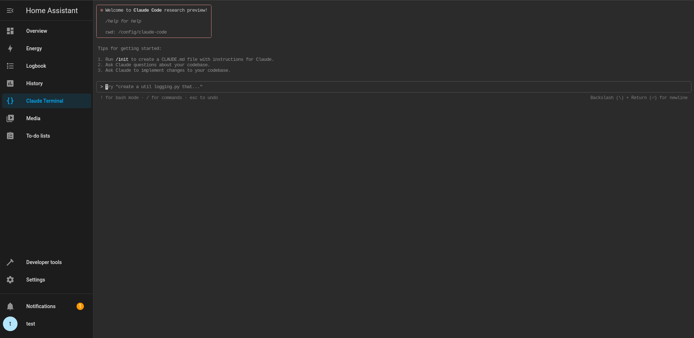

# Codex Terminal Pro

[](https://my.home-assistant.io/redirect/supervisor_add_addon_repository/?repository_url=https%3A%2F%2Fgithub.com%2Fjgassens%2Fcodex-terminal-pro)

Unofficial OpenAI Codex CLI terminal for Home Assistant.

Codex Terminal Pro provides a Home Assistant ingress web terminal that starts in
`/config`, with Codex CLI, image paste support, persistent packages, Home
Assistant CLI, and GitHub CLI preinstalled.

It registers an admin-only Home Assistant sidebar panel titled **Codex Terminal
Pro** through ingress.

The web terminal wrapper uses a compact Codex-focused interface around ttyd,
with voice input and image upload controls kept one click away from the prompt.

The terminal runs inside a persistent `tmux` session, so browser reconnects and
Home Assistant ingress websocket drops should reattach instead of restarting
Codex.

Mouse wheel scrolling uses tmux scrollback instead of sending history keys to
Codex. If needed, enter tmux copy mode with `Ctrl-b [` and leave it with `q`.
Terminal output is also mirrored to `/data/logs/codex-terminal.log`; treat that
file as sensitive.

Highlighted terminal text is copied to the browser clipboard when the selection
finishes. tmux mouse selections are forwarded to the browser clipboard through
OSC 52 support.

Dropped or pasted images are uploaded to `/data/images`, and the saved image
path is inserted directly into the Codex prompt.

Fresh installs add supported Codex TUI defaults in `/data/.codex/config.toml`:
Catppuccin Mocha theme colors, a richer footer with run state, task progress,
context remaining, rate-limit percentages, git metadata, permissions, approval
mode, and Codex version, plus an activity-aware terminal title. Existing
user-customized Codex TUI config is left untouched.



## Quick Start

1. Click the button above to add the custom repository, or add it manually:

   ```text
   https://github.com/jgassens/codex-terminal-pro
   ```

2. Install **Codex Terminal Pro** from the Home Assistant add-on store.
3. Start the add-on.
4. Open the web UI.
5. Run:

   ```bash
   codex-auth-helper
   ```

6. Choose device-code login, then start Codex from the menu.

## Updating From GitHub

Install from `https://github.com/jgassens/codex-terminal-pro` in the Home
Assistant add-on store to receive updates from GitHub. A local `/addons`
install, usually shown with a `local_` slug, is only for development testing and
does not track GitHub.

When a new version is pushed, reload the Home Assistant add-on store and update
the add-on from the UI. Version detection comes from `config.yaml`.

## Configuration

```yaml
auto_launch_codex: true
terminal_transcript_enabled: true
terminal_transcript_max_bytes: 1048576
terminal_transcript_backups: 2
image_retention_days: 30
image_retention_max_bytes: 268435456
persistent_apk_packages: []
persistent_pip_packages: []
```

- `auto_launch_codex`: Start Codex automatically when the terminal opens. The
  MVP now defaults this to `true`; set it to `false` to open the session picker
  first.
- `terminal_transcript_enabled`: Mirror terminal output to
  `/data/logs/codex-terminal.log` so warnings can be recovered after they scroll
  away.
- `terminal_transcript_max_bytes` and `terminal_transcript_backups`: Rotate the
  transcript before it grows without bound.
- `image_retention_days` and `image_retention_max_bytes`: Clean up old uploaded
  images from `/data/images`.
- `persistent_apk_packages`: APK packages to reinstall into persistent storage.
- `persistent_pip_packages`: Python packages to install into the persistent
  virtual environment.

## Auth

Device-code login is preferred for headless Home Assistant use:

```bash
codex-auth-helper
```

The helper sets `CODEX_HOME=/data/.codex`, ensures file credential storage in
`/data/.codex/config.toml`, and fixes `/data/.codex/auth.json` permissions to
`600` if present.

Plain browser login is not reliable in the add-on because Codex completes OAuth
through `localhost:1455`, which points at your browser machine instead of the
Home Assistant container. Use device-code login or import `auth.json`.

Fallback import is supported by copying a local `~/.codex/auth.json` into
`/data/.codex/auth.json`. Treat that file like a password because it contains
access tokens.

ChatGPT subscriptions are used through Codex account auth. API-key auth would
use OpenAI API billing and is not part of the MVP add-on configuration.

## Safety

- Back up Home Assistant before edits.
- Ask Codex to inspect first.
- Ask Codex to show diffs before changing files.
- Run `ha core check` before reloads or restarts.
- Only restart Home Assistant after explicit confirmation.

## Architecture

The MVP supports `amd64` and `aarch64`. `armv7` is not supported until Codex can
be verified on that platform.

## Attribution

This MIT-licensed fork preserves the Home Assistant add-on wrapper and utility
work from the original upstream terminal add-ons, then swaps the runtime layer to
OpenAI Codex CLI. It is not an official OpenAI add-on.

The Codex icon assets are from LobeHub Icons and are distributed under the MIT
License.
